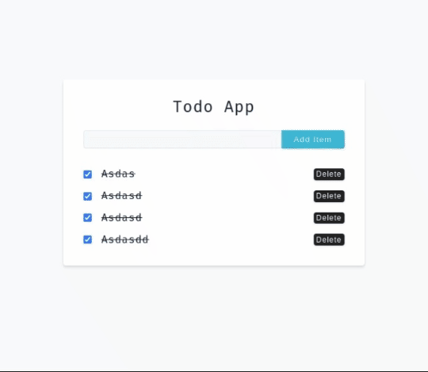
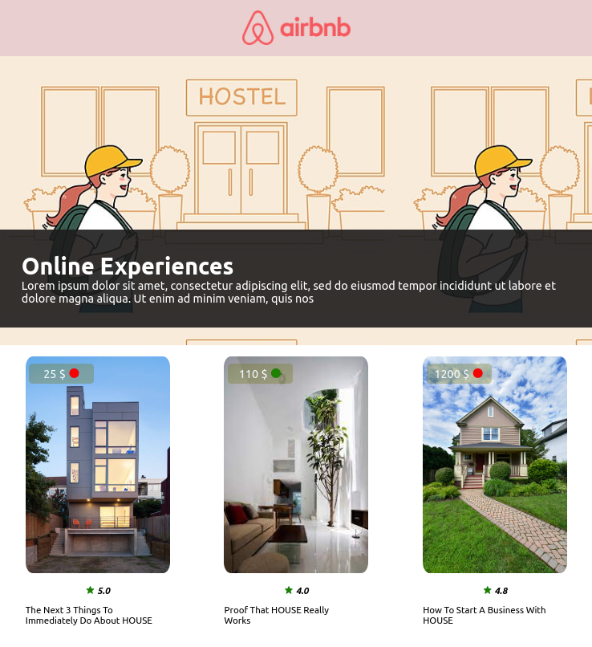
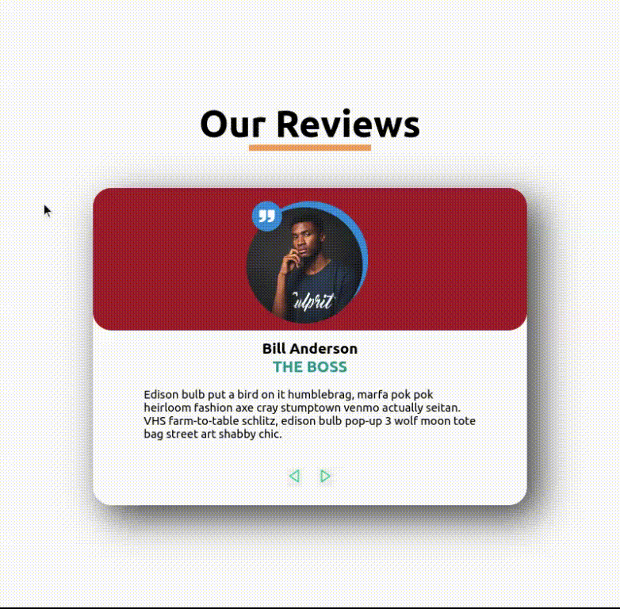
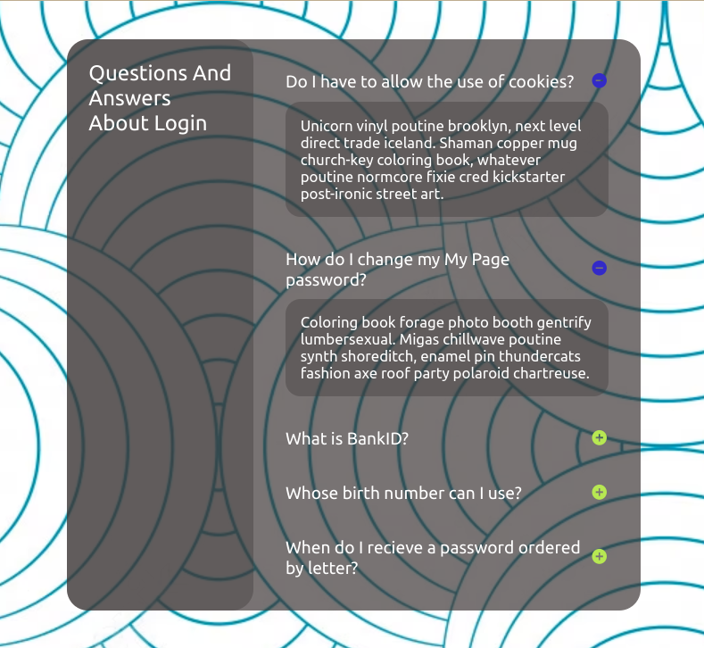

# simple-react-projects
This repo is a practice repo for simple react projects

# Budget APP (react-router)
[budgetApp.webm](https://github.com/iamworldian/simple-react-projects/assets/44906541/939f5f63-e2a1-4e1f-b5fa-71ca657a3b29)
# React Router DOM

# Todo App

# Quote Generator

# Airbnb Simple

# Tours

# Reviews

# Accordion

# Tabs

# Color Generator

